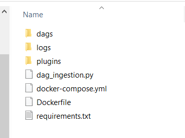

## Chaine de streaming avec des containers Dockers/Kafka, Airflow\...pour l’analyse des paramètres vitaux des patients

Mettre en place une configuration de streaming afin de traiter des données reçues en continu en utilisant Docker, Kafka, Airflow\...

## Description de la Chaine de streaming : Solution ETL pour l’analyse des paramètres vitaux des patients

Dans le cadre de la mise en place d’une chaîne de streaming avec des containers Dockers/Kafka et Airflow, nous avons élaboré une solution ETL pour l’analyse des paramètres vitaux des patients.

En effet, la surveillance continue des patients et l'analyse en temps réel de leurs données vitales sont devenues des impératifs. Les établissements de santé sont confrontés à un volume croissant de données provenant de dispositifs médicaux connectés, de capteurs portables et de systèmes d'information hospitaliers. Pour transformer ces données brutes en informations exploitables et améliorer la prise de décision clinique, une infrastructure de traitement de données robuste et évolutive est indispensable.

## Architecture réalisée pour notre solution

Le pipeline de traitement s'exécute **toutes les 5 minutes** et comprend les étapes suivantes :

1. **Génération des données** : Données des patients avec leurs paramètres vitaux.
2. **Ingestion des données** dans Kafka.
3. **Traitement des données** en trois étapes successives :
   - Extraction du nom et prénom.
   - Formatage de la date (timestamp).
   - Classification de la pression artérielle en fonction de la pression et de l'âge.
4. **Stockage des données dans Redis** sous forme de liste avec la clé **"liste-patients"**.
5. **Visualisation des données avec Grafana** pour l'analyse des paramètres vitaux stockés dans Redis.

## Déploiement de la solution


### **Prérequis**

Avant de lancer le projet, assurez-vous d’avoir installé :

- **Docker**
- **Python 3.x**
- **Grafana** (optionnel)

### **Étapes de Lancement du projet**

1. **Cloner le repository**

   ```bash
   git clone https://github.com/votre-repository.git
   cd votre-repository
   ```

2. **Initialiser l'environnement**\
   Pour initialiser l'environnement, exécutez la commande suivante :

   ```bash
   docker-compose up airflow-init
   ```

3. **Démarrer l'exécution d'Airflow**\
   Vous pouvez démarrer l'exécution d'Airflow en exécutant la commande :

   ```bash
   docker-compose up -d
   ```

   Vous pouvez vérifier que le conteneur fonctionne en exécutant la commande :

   ```bash
   docker ps
   ```

   > **Remarque :** Dans votre dossier `votre-repository`, vous devriez trouver les fichiers et dossiers suivants :

   

4. **Accès à l'interface Web Airflow**\
   Connectez-vous à l'interface Web et essayez d'exécuter certaines tâches.

   - 📌 Le serveur Web est disponible à l'adresse : [**http://localhost:8080**](http://localhost:8080)
   - 🔑 Utilisez le compte par défaut :
     - **Utilisateur** : `airflow`
     - **Mot de passe** : `airflow`

5. **Exécution du DAG de notre solution**

   5.1 **Ajouter le fichier DAG**\
   Placez le fichier `dag_ingestion.py` dans le répertoire `votre-repository/dags` :

   ```bash
   mv dag_ingestion.py dags
   ```

   5.2 **Activer le DAG**

   - Dans l'interface Web Airflow, repérez le DAG avec l'identifiant **a\_kafka\_redis\_airflow**
   - Activez-le en cliquant sur le bouton d’activation

   5.3 **Explorer le DAG**

   - ✅ Visualiser le **schéma du DAG**
   - ✅ Vérifier le **diagramme de Gantt**
   - ✅ Consulter les **logs de chaque tâche**
   - ✅ Déboguer en cas d’erreur

## **Accès aux données stockées dans Redis**

Après l’exécution du pipeline, vous pouvez vérifier que les données des patients ont bien été enregistrées dans Redis :

1. Accédez au conteneur Redis :
   ```bash
   docker exec -it redis redis-cli
   ```
2. Consultez la liste des patients stockée :
   ```bash
   LRANGE liste-patients 0 -1
   ```

## **Visualisation des données avec Grafana**(Optionel)

Grafana est utilisé pour analyser et visualiser les données stockées dans Redis.

### **1. Accès à Grafana**

L’interface Web de Grafana est disponible à l'adresse suivante :

🔗 [**http://localhost:3001**](http://localhost:3001)

Utilisez les identifiants par défaut :

- **Utilisateur** : `admin`
- **Mot de passe** : `admin` (modifiable après la première connexion).

### **2. Configuration de Redis comme source de données**

- Dans Grafana, accédez à **Configuration > Data Sources**.
- Ajoutez une nouvelle source de données et sélectionnez **Redis**.
- Configurez la connexion en précisant l’adresse du conteneur Redis et le port **6379**.
- Sauvegardez et testez la connexion.

### **3. Création d'un tableau de bord**

- Ajoutez un **nouveau tableau de bord**.
- Configurez des graphiques pour afficher les paramètres vitaux des patients.
- Personnalisez l'affichage selon les besoins d'analyse.
- ...

## Résultats obtenus


---
